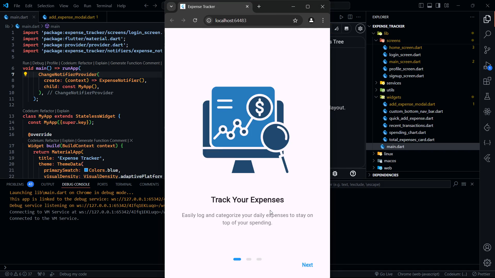

# Expense Tracker - Your Personal Finance Manager

Expense Tracker is a full-stack Flutter application designed to help you manage your personal finances efficiently. With a user-friendly interface and powerful features, it allows you to track expenses, set budgets, and gain insights into your spending habits.

## Features

- 📊 Easy expense logging and categorization
- 💰 Budget setting and tracking
- 📈 Visual representations of spending patterns
- 🔔 Customizable alerts for budget limits
- 🔒 Secure user authentication
- 💾 Cloud synchronization for data backup

## Demo

Check out the demo video to see Expense Tracker in action:
    [](demo.mp4)

## Setup Instructions

Follow these steps to set up the Expense Tracker project on your local machine:

1. **Clone the repository**
   ```
   git clone https://github.com/yourusername/expense-tracker.git
   cd expense-tracker
   ```

2. **Install Flutter**
   - Follow the [official Flutter installation guide](https://flutter.dev/docs/get-started/install) for your operating system.

3. **Install dependencies**
   ```
   flutter pub get
   ```

4. **Set up Firebase**
   - Create a new Firebase project in the [Firebase Console](https://console.firebase.google.com/)
   - Add an Android and/or iOS app to your Firebase project
   - Download the `google-services.json` (for Android) or `GoogleService-Info.plist` (for iOS) and place it in the appropriate directory
   - Enable Authentication and Firestore in your Firebase project

5. **Configure Firebase in the app**
   - Update the Firebase configuration in `lib/services/firebase_service.dart` with your project's details

6. **Run the app**
   ```
   flutter run
   ```

## Technologies Used

- Flutter for cross-platform mobile development
- Firebase for backend services (Authentication, Firestore)
- Provider for state management
- Express.js (temporary backend solution)

## Future Improvements

- Implement data visualization with interactive charts
- Add support for recurring expenses and income
- Integrate with bank APIs for automatic transaction importing
- Develop a web version for desktop use
- Implement machine learning for expense predictions and insights
- Add social login functionality
- Integrate with firebase

---